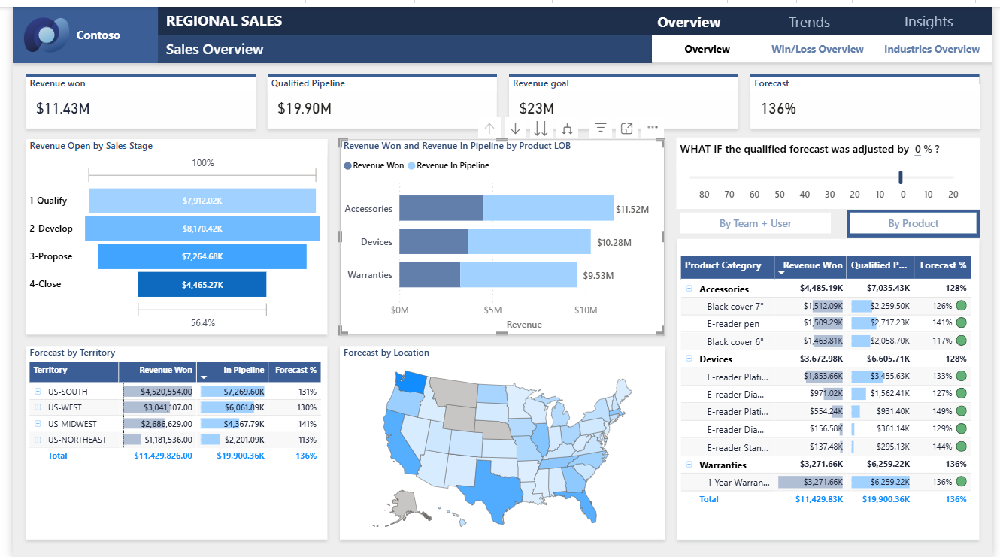

# 📊 Regional Sales Analysis Dashboard | Power BI

📊 Business-Focused Sales Analytics Dashboard for Regional Performance & Revenue Optimization  
📌 End-to-End Project: Data Modeling → DAX KPIs → Power BI Dashboard → Business Insights  
⭐ Highlight: Identified top-performing regions and product categories driving majority of revenue  

---

## 🚀 Project Overview

This project analyzes **regional sales performance and revenue trends** using an interactive **Power BI dashboard**.

📊 Dataset includes multi-dimensional sales data across regions, products, and time  

👉 The goal is to:
- Identify high-performing regions  
- Analyze product-level sales contribution  
- Understand sales trends and seasonality  
- Support data-driven business decisions  

---

## 🎯 Business Problem

Businesses often struggle to:

- Identify which regions drive the most revenue  
- Track performance across product categories  
- Analyze profitability across regions  
- Understand sales trends over time  

👉 Key Question:  
**How can businesses optimize regional sales performance and maximize revenue?**

---

## 🛠 Tools & Technologies

- Power BI – Dashboard Development  
- DAX – KPI Calculations  
- Data Modeling  
- Business Intelligence  

---

## 📊 Dataset

The dataset includes:

- Region  
- Product Category  
- Sales Revenue  
- Profit  
- Order Details  
- Time-based sales data  

---

## 🔄 Data Processing Workflow

1. Data cleaning and transformation  
2. Data modeling and relationship building  
3. KPI creation using DAX  
4. Dashboard design and visualization  

---

## 📈 Dashboard Features

### ✔ Sales Overview
- Total Sales  
- Total Profit  
- Sales Growth Trends  
- Regional Contribution  

---

### ✔ Regional Performance
- Region-wise sales comparison  
- Identification of top-performing regions  
- Profitability analysis  

---

### ✔ Product Performance
- Top-performing product categories  
- Revenue and profit contribution  

---

### ✔ Sales Trends
- Monthly sales trends  
- Seasonal pattern identification  

---

## 📊 Key Insights

- Top regions contribute ~50–60% of total revenue  
- Certain product categories dominate sales performance  
- Sales trends show seasonal spikes during peak months  
- Profitability varies significantly across regions  

---

## 💡 Business Recommendations

- Focus on high-performing regions to maximize revenue  
- Optimize strategies in underperforming regions  
- Promote top-performing product categories  
- Improve profitability through cost optimization  

---

## 📷 Dashboard Preview

---

## 🎯 Impact

- Analyzed regional sales data to identify revenue drivers  
- Built interactive dashboard for performance tracking  
- Enabled data-driven decision-making  
- Improved visibility into regional and product performance  

---

## ⭐ Future Enhancements

- Sales forecasting using time series models  
- Customer segmentation analysis  
- Integration with cloud platforms (AWS / Azure)  

---

## 👨‍💻 Author

**Chandan Kumar Sah**  
Data Analyst | SQL • Power BI • Python • Machine Learning  

---

⭐ If you found this project useful, consider giving it a **star**
